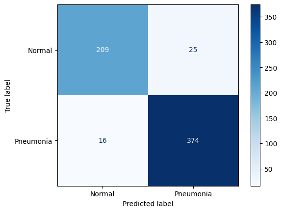

# 🫁 Chẩn đoán Viêm phổi qua ảnh X-quang bằng Deep Learning (Pneumonia Detection)

## 📌 Giới thiệu dự án
Dự án này ứng dụng Học sâu (Deep Learning) để tự động phân loại hình ảnh X-quang ngực thành hai nhóm: **Khỏe mạnh (Normal)** và **Viêm phổi (Pneumonia)**. 
Mục tiêu của dự án là xây dựng một hệ thống hỗ trợ y tế có độ nhạy cao, giúp các bác sĩ chẩn đoán nhanh chóng và giảm thiểu tối đa rủi ro bỏ sót bệnh nhân.

## 📊 Tập dữ liệu (Dataset)
* **Nguồn:** [Chest X-Ray Images (Pneumonia)](https://www.kaggle.com/datasets/paultimothymooney/chest-xray-pneumonia) từ Kaggle.
* **Đặc điểm:** Dữ liệu y tế thực tế, bao gồm hàng ngàn bức ảnh X-quang phân giải cao.
* **Thách thức:** Dữ liệu bị mất cân bằng (Class Imbalance) nghiêm trọng khi số ca Viêm phổi nhiều gấp gần 3 lần số ca Khỏe mạnh.

## 🛠 Cấu trúc Mô hình & Kỹ thuật sử dụng
Dự án được xây dựng bằng **PyTorch** với các kỹ thuật tối ưu hóa sau:
* **Kiến trúc mạng:** Tận dụng **Transfer Learning** với mô hình **ResNet18** (Pre-trained trên ImageNet).
* **Tiền xử lý dữ liệu (Data Pipeline):** Sử dụng Data Augmentation (RandomResizedCrop, RandomHorizontalFlip, RandomRotation) và chuẩn hóa màu sắc theo hệ số chuẩn của ImageNet để chống Overfitting.
* **Xử lý mất cân bằng dữ liệu:** Tinh chỉnh hàm loss bằng `BCEWithLogitsLoss` kết hợp với tham số `pos_weight` để phạt nặng các lỗi sai, giúp mô hình không bị "đoán bừa".

## 📈 Kết quả Huấn luyện (Performance)
Sau 15 epochs huấn luyện, mô hình đã đạt được những chỉ số cực kỳ ấn tượng trên tập Test:

* **Accuracy (Độ chính xác tổng thể):** **93.43%**
* **F1-Score:** **0.93** (Cho thấy mô hình học rất cân bằng giữa 2 nhãn).
* **Recall (Độ nhạy) của lớp Viêm phổi:** **96%** 🚨
  > *Ghi chú Y tế: Trong chẩn đoán y khoa, việc tránh bỏ sót bệnh nhân (Âm tính giả) là ưu tiên hàng đầu. Với Recall lên tới 96%, hệ thống chỉ bỏ sót vỏn vẹn 16/390 ca bệnh thực tế. Việc dự đoán nhầm một số ca khỏe mạnh thành viêm phổi (Dương tính giả) nằm trong mức an toàn để bác sĩ chỉ định xét nghiệm chuyên sâu thêm.*

### Ma trận nhầm lẫn (Confusion Matrix)
*(Ghi chú cho HoangHoan17: Cập nhật lại đường dẫn ảnh bên dưới sau khi bạn upload bức ảnh Confusion Matrix lên thư mục của GitHub nhé)*


## 💻 Hướng dẫn chạy thử (How to Run)
1. Clone repository này về máy:
   ```bash
   git clone [https://github.com/user2001230258/Pneumonia_Detection_ResNet.git](https://github.com/user2001230258/Pneumonia_Detection_ResNet.git)
2. Cài đặt các thư viện cần thiết:
   ```bash
   pip install torch torchvision matplotlib scikit-learn pillow
3. Mở file resnet_transfer_learning.ipynb trên Jupyter Notebook hoặc Google Colab để chạy lại quá trình huấn luyện hoặc thử dự đoán với một bức ảnh mới.
